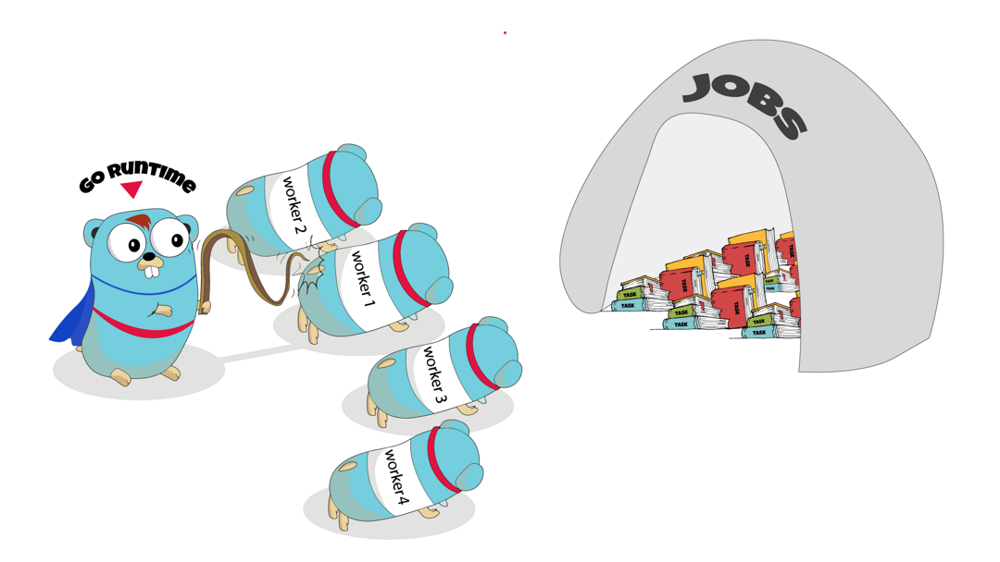

# WorkerPool

<p align="center"></p>

Worker pool is a Go package that provides a simple and efficient implementation of a worker pool for concurrent task execution.

## Installation

To use the Worker Pool package, you need to install it using `go get`:

```sh
go get -u github.com/adehikmatfr/workerpool
```
# Usage
## Basic Example

```go
package main

import (
	"fmt"

	workerpool "github.com/adehikmatfr/workerpool"
)

func main() {
	// Create a new worker pool with a maximum of 3 workers
	wp := workerpool.NewWorkerManager(3)

	// Define a job function that increments a counter
	counter := 0
	jobFunc := func() {
		counter++
	}

	for i := 0; i < numJobs; i++ {
		wp.SubmitJob(jobFunc)
	}

	// Stop the worker pool and wait for jobs to complete
	wp.StopAndWait()

    // log result
    fmt.Println(counter)
}
```